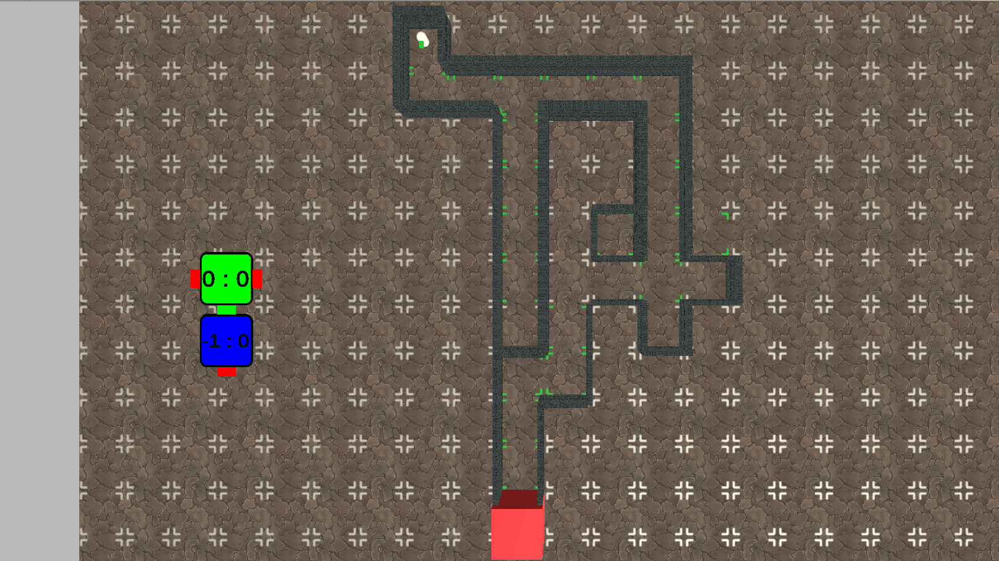

# Path Discovery

This is from my undergraduate thesis project. The idea was to create a pathfinding algorithm that did not depend on knowing all the terrain before making any desition. The AI agent charts the terrain as it moves and makes its decision is based on an euristhic that takes into account the distance to the node and probability of finding new paths with that node.

## Components
- AIBehaviour is the main controller of the agent
- AiBrain is responsible for choosing the next node to navigate
- AiMovent is responsible for moving the agent
- MappingBehaviour is responsible for charting the nodes that surrounds the agent

## Examples:

## My Thesis
I also added my undergraduate thesis (Path Discovery), unfortunately, it is available only in Portuguese.